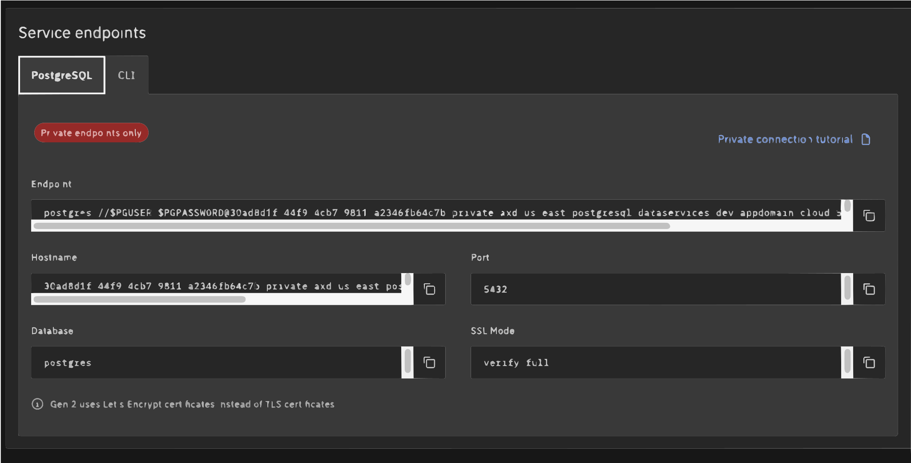
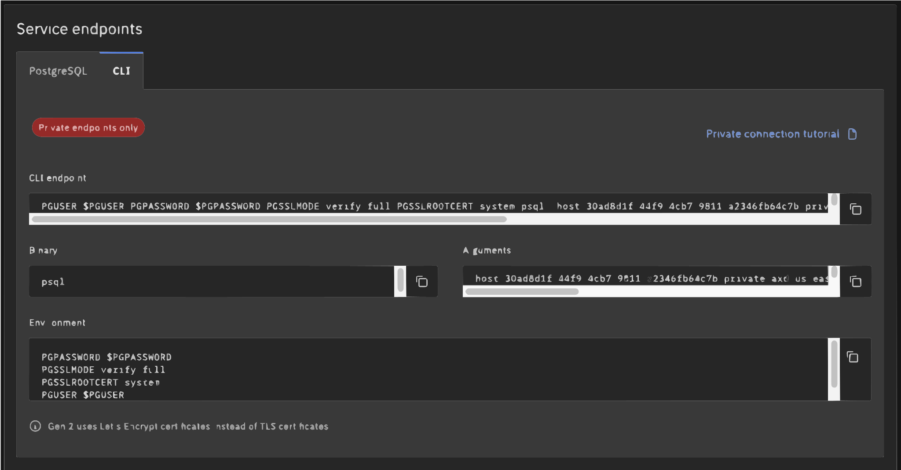

---
copyright:
  years: 2025
lastupdated: "2025-12-10"

keywords: postgresql, databases, postgres connections string, postgresql connection string, Gen 2

subcollection: databases-for-postgresql-gen2

---

{{site.data.keyword.attribute-definition-list}}


# Getting connection strings
{: #connection-strings}

[Gen 2]{: tag-purple}

{{site.data.keyword.databases-for}} Gen 2 is currently in Beta. The Beta plan is provided exclusively for evaluation and testing purposes. It is not covered by warranties, SLAs, or support, and is not intended for production use. For more information, see the [Beta reference](/docs/cloud-databases-gen2?topic=cloud-databases-gen2-icd-gen2-beta).
{: beta}

## Getting connection strings in the UI
{: #connection-strings-ui}
{: ui}

Follow these steps to retrieve your {{site.data.keyword.databases-for-postgresql_full}} instance connection strings:

1. In your deployment's **Overview page**, scroll down to the **Service endpoints** section.
1.  The **Service endpoints** section displays tabs for available connection methods:
   - **PostgreSQL** – Shows the connection string, hostnames, ports, database name, authentication source, and replica set for your deployment.
   - **CLI** – Provides details for connecting by using the [{{site.data.keyword.IBM_notm}} CLI](https://www.ibm.com/cloud/cli){: external}.

{: caption="Getting connections strings - Service endpoints PostgreSQL tab" caption-side="bottom"}

{{site.data.keyword.databases-for-postgresql}} deployments no longer include a default `admin user`. Instead, you create a user with the 'Manager', 'Writer', or 'Reader' role using the {{site.data.keyword.cloud}} service credential interface — via UI or CLI. This provides a username(ibm_...), password, and connection string that can be used to connect to your deployment.
{: .tip}

## Getting connection strings in the CLI
{: #connection-strings-cli}
{: cli}

You can also find the endpoint under the CLI tab of the service endpoints.

{: caption="Getting connections strings - Service endpoints CLI tab" caption-side="bottom"}

You can also retrieve connection strings using the [{{site.data.keyword.databases-for}} CLI plug-in](/docs/cloud-databases-gen2?topic=cloud-databases-gen2-cdb-reference) Connection command.

The command looks like this:

```sh
ibmcloud resource service-instance <INSTANCE_NAME_OR_CRN>
```
{: pre}

For more information, see [Connections command options](/docs/cloud-databases-gen2?topic=cloud-databases-gen2-cdb-reference).

{{site.data.keyword.databases-for-postgresql}} deployment no longer include a default admin user. Instead, customers create a user with the 'Manager', 'Writer', or 'Reader' role using the {{site.data.keyword.cloud}} service credential interface — via UI or CLI. This provides a username(ibm_...), password, and connection string that can be used to connect to your deployment. If your deployment has only a private endpoint, you must specify `--endpoint-type private` or the commands return an error. The user and endpoint type is not enforced. You can use any user on your deployment with the private endpoint, which is the designated connection option.

To use the `ibmcloud cdb` CLI commands, you must [install the {{site.data.keyword.databases-for}} plug-in](/docs/cloud-databases-gen2?topic=cloud-databases-gen2-cdb-reference).
{: .tip}

## Getting connection strings in the API
{: #connection-strings-api}
{: api}

To retrieve users' connection strings from the [{{site.data.keyword.databases-for}} API](/docs/cloud-databases-gen2?topic=cloud-databases-gen2-api){: external}, use the [Connections endpoint](/docs/cloud-databases-gen2?topic=cloud-databases-gen2-api){: external}. To create the connection strings, ensure that the path includes the specific user and endpoint type that should be used. The `user` is not restricted or enforced. You have the flexibility to utilize any user available in your deployment.

The API command looks like:

```sh
curl -X GET 'https://resource-controller.cloud.ibm.com/v2/resource_instances/{id}' -H "Authorization: Bearer <IAM token>""
```
{: pre}

Remember to replace {region}, {id}, {userid}, and {endpoint_type} with the appropriate values.
{: note}

## Getting connection strings in the API
{: #connection-strings-api}
{: api}

To retrieve user's connection strings from the API, use the [`/users/{userid}/connections`](/docs/cloud-databases-gen2?topic=cloud-databases-gen2-api) endpoint. You must specify in the path which user and which type of endpoint (public or private) is to be used in the returned connection strings. The user and endpoint type is not enforced. You can use any user on your deployment with either endpoint (if both exist on your deployment).

```sh
curl -X GET -H "Authorization: Bearer $APIKEY" 'https://api.{region}.databases.cloud.ibm.com/v4/ibm/deployments/{id}/users/{userid}/connections/{endpoint_type}'
```
{: pre}

## Connection string breakdown
{: #connection-string-breakdown}

### The PostgreSQL section
{: #postgres-section}

The "PostgreSQL" tab contains information that is suited to applications that make connections to PostgreSQL.

| Field name | Index | Description |
| ---------- | ----- | ----------- |
| `Type` | | Type of connection - for PostgreSQL, it is "URI". |
| `Scheme` | | Scheme for a URI - for PostgreSQL, it is "postgresql". |
| `Path` | | Path for a URI - for PostgreSQL, it is the database name. The default is `ibmclouddb`. |
| `Authentication` | `Username` | The username that you use to connect. |
| `Authentication` | `Password` | A password for the user - might be shown as `$PASSWORD`. |
| `Authentication` | `Method`|How authentication takes place; "direct" authentication is handled by the driver. |
| `Hosts` | `0...` | A hostname and port to connect to. |
| `Composed` | `0...` | A URI combining Scheme, Authentication, Host, and Path. |
{: caption="PostgreSQL/URI connection information" caption-side="top"}

* `0...` indicates one or more of these entries in an array.

### The CLI section
{: #cli-section}
{: cli}

The "CLI" section contains information that is suited for connecting with `psql`.

| Field name | Index | Description |
| ---------- | ----- | ----------- |
| `Bin` | | The binary to create a connection; in this case it is `psql`. |
| `Composed` | | A formatted command to establish a connection to your deployment. The command combines the `Bin` executable, `Environment` variable settings, and uses `Arguments` as command line parameters. |
| `Environment` | | A list of key/values you set as environment variables. |
| `Arguments` | 0... | The information that is passed as arguments to the command shown in the Bin field. |
| `Type` | | The type of package that uses this connection information; in this case `cli`.  |
{: caption="PostgreSQL/cli connection information" caption-side="top"}

* `0...` indicates that there might be one or more of these entries in an array.
